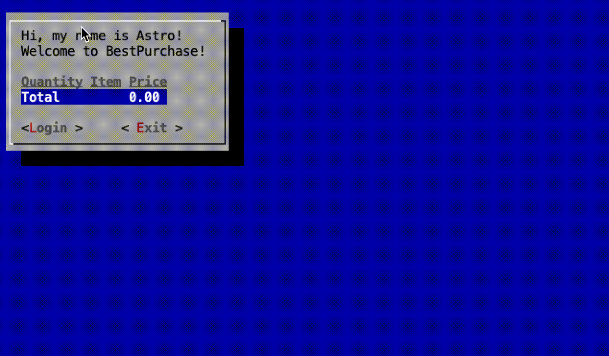

# CS682 Term Project

This proof of concept that simulates a BestPurchase customer doing shopping inside a store.  The focus is to demonstrate the module/class design soundness and stability.

[YouTube demo video](https://youtu.be/fjH7R51kG6A) of the code in action with annotations.

[YouTube demo video](https://youtu.be/t_IspRi5V8o) of the code in action with Text UI.

## Application Stack

- [Java 17](https://openjdk.java.net/projects/jdk/17/)
- [Dagger 2](https://dagger.dev)
- [vavr](https://www.vavr.io)
- [ØMQ](https://zeromq.org)

